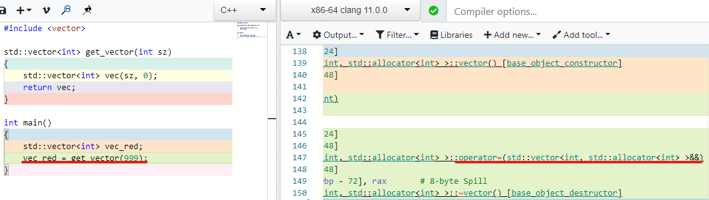

# 认识C++移动语义与右值引用  
本文假设读者对C++基本语法和常见STL组件的基本操作有一定的了解。<br>


## 移动一个`std::vector` <br>
在介绍右值引用或移动语义时，常见到移动语义能提高复制对象性能的说法，那么这究竟是怎么回事呢？一起来看移动构造`std::vector`的例子，在脑海中快速地建立起移动语义的概念。<br>

先是`std::vector`的复制构造：
```
    std::vector<int> vec_orange = { 1, 42, 23, 7, 13 };
    std::vector<int> vec_red = vec_orange;
```
<br>
图源：[moves demystified][1]<br>

一切都很符合直觉：在堆上分配新的空间，把原来的数组复制一遍。再来看移动构造[例1]：<br>
```
    std::vector<int> vec_orange = { 1, 42, 23, 7, 13 };
    std::vector<int> vec_red = std::move(vec_orange);
```

<br>
图源：[moves demystified][1]<br>

可以看到，移动构造`red_vector`时，并没有把原来的数组内容复制一遍，而是直接把指针指向`orange_vector`的数组，然后把`orange_vector`的指针置空，再设置`red_vector`的大小为该数组的大小，是否简单明了？这样依赖，无论数组多大，移动构造都只需要设置几个寄存器大小的变量，相比复制构造要去动态分配内存、再递归调用每个元素的复制构造函数的速度快得多，这便是“移动语义提升性能”的一种直观体现。<br>

**移动语义的“移动”，意味着把某对象持有的资源或内容转移给另一个对象。** 在转移资源后，被移动的对象（橙vector）处于“有效但未定义的状态”（valid but unspecified state）。怎么理解这句话呢？如图，橙vector未被析构，可以继续当成一个普通的vector操作，此为“有效”；但里面的内容不见了，不应该继续访问它，此为“未定义”——因此，如果要移动一个左值对象，通常在它生命周期结束时移动，因为之后不会再有代码操作它；或者把它设为一个周知的状态，比如给它赋值，或者调用vector的`clear()`成员函数，以明确其状态。<br>

再来看一个例子，把`vector`作为函数返回值[例2]：
```
    #include <vector>

    // 返回一个可能很大的vector
    std::vector<int> get_vector(int sz)
    {
        std::vector<int> vec(sz, 0); // 全部填0
        return vec;
    }

    int main()
    {
        std::vector<int> vec_red;
        vec_red = get_vector(999); // 返回含有999个0的vector
    }
```
在这段代码中，函数`get_vector(int)`会返回一个vector。如果没有移动语义（C++11前），就需要把999个元素都复制一遍；而自C++11起，以上代码只会把999个0的vector构造一遍，然后移动给`vec_red`。可以看看Clang 11.0.0编译器生成的机器码，这是粗暴但确凿的观察：<br>
<br>
可以去[Compiler Explorer][2]自己玩玩这个例子<br>

可以看到，当vec_red被赋值时，编译器调用的是它的移动赋值函数，其参数为一个右值引用`vector&&`。<br>

## 左值，右值？
好的，怎么右值一会是`std::move()`，一会是函数返回值，它们都是右值吗，还是有什么其他关系？<br>

首先来简单粗暴地解释一下左值（lvalue）和右值（rvalue）。顾名思义，左值就是“能出现在赋值号左边的值”，当然也可以在右边；而右值则只能出现在赋值号右边。典型的左值有：<br>
- 有名字的变量；<br>
- 可以取地址的变量；<br>
- 指针解引用的值（使用语言内置的`*`或`->`运算符）；<br>
回忆[例1]：<br>
```
    // vec_red = vec_orange;            // vec_orange被绑定到const std::vector<int> &类型
    vec_red = std::move(vec_orange);    // vec_orange被绑定到std::vector<int> &&类型    
```
`vec_orange`是一个左值（它有名字），不经过`std::move()`的转型则会绑定到一个左值引用；而`std::move()`则把它转为一个右值引用，从而匹配到移动赋值运算符函数。典型的右值有：<br>
- 字面值（literal），比如`1`， `true`， `nullptr`——但字符串常量不是右值而是左值，它们被编译器放在数据段（data segment），可以取地址；<br>
- 非引用类型的函数返回值；<br>
- 各种内置的运算符组合表达式的计算结果。<br>
> 实际上，C++语法中把表达式分为三种值类型，分别是：纯右值（prvalue），将亡值（xvalue），和左值（lvalue）。<br>

## 实现移动语义 <br>
那么像[例2]中，赋值号右方是非引用类型的函数返回值时，`std::vector`的赋值运算符函数重载决议会挑选参数为一个右值的版本。下面来看一个玩具vector代码来直观地感受一下，其根据左值和右值重载了构造函数（赋值运算符代码略长但道理一样）[例3]：
```
class my_vector
{
    int* data_;
    size_t size_;
    size_t capacity_;

public:
    // 复制构造函数
    my_vector(const my_vector& oth) :
        size_(oth.size_), 
        capacity_(oth.capacity_)
    {
        data_ = static_cast<int*>(malloc(sizeof(int) * size_));
        for (size_t i = 0; i < size_; ++i) {
            data_[i] = oth.data_[i];
        }
    }

    // 移动构造函数
    // std::exchange(obj, new_val)的作用是把返回obj的旧值，并把new_val赋值给obj
    my_vector(my_vector&& oth) :
        data_(std::exchange(oth.data_, nullptr)),
        size_(std::exchange(oth.size_, 0)), 
        capacity_(std::exchange(oth.capacity_, 0))
    {}    
};
```
在上面这段代码中，移动构造函数把参数`oth`的内容占为己用。如前文所言，移动语义意味着把对象持有的资源或内容转移给另一个对象。此处，对`std::exchange()`的使用也值得留意。**在移动`oth`的内容后，要把它置于一个有效状态。** 一个典型vector控制一个动态分配的数组的生命周期。如果移动了一个有数据的`my_vector`对象，却不把它的`data_`成员设为空指针，移动构造的和被移动的`my_vector`将重复地调用数组元素的析构函数、释放同一块内存，造成内存损坏！<br>

**右值引用是C++语法层面表示移动语义的机制**。以上的例子说明，为了利用右值，在常见的左值引用外，C++标准又定义了右值引用，不经过转型时，只有右值能被绑定到右值引用（`std::move()`可以把任意类型转为右值引用）；然后基于参数类型不同进行函数重载的机制，程序员就可以针对右值引用编写重载函数，从而达到利用右值的目的。以下通过代码继续讲解这一点[例4]：<br>
```
template <typename T>
struct my_collection
{
    std::vector<T> collection_;
    
    void add(T thing)       // 按值传递
    {
        collection_.push_back(thing);
    }
    void add(const T& thing) // 按常量左值引用传递
    {
        collection_.push_back(thing);
    }
    void add(T&& thing)     // 按右值传递
    {
        collection_.push_back( std::move(thing) );
    }
};
```
看到`add()`函数的三个重载，可以更清楚地知道，右值引用不过是另一个类型，没有那么神秘！根据参数类型不同，函数的行为可以有所差别；而当参数类型为右值引用时，函数移动它的资源，即为“移动语义”。在汇编代码的层面来看，左值或右值引用的representation都是一个内存地址，如同指针一般；而在C++语法层面，通过区分两种引用类型，程序员能更好地利用右值。<br>

**一个C++表达式有两个属性，分别是它的类型（type）和值的种类（[value categories][3]）。引用属于type的范畴，而左、右值属于value category的范畴。** 了解到type和value category两个属性后，能更好理解一些令人迷惑的地方：比如，左值可以经过`std::move()`转型为右值引用，右值可以绑定到左值引用。左值和右值的区分天然地存在，没有右值引用这个类型，我们也可以正常使用右值（比如接收一个函数的返回值，它是一个右值）。上面这段代码中，还有两个值得留意的点：<br>
1. 为什么参数为右值时，还要再`std::move()`一回？如上文所言，区分左右值的标准之一就是变量是否有名字。`thing`虽然是个右值引用（type），但它有名字，因此仍然是左值（value category）；如果要移动它，就得调用`std::move()`把它转换为右值引用。<br>
2. 可以写`const T&&`吗？这个引用类型确实是合乎语法的，但是语义上存在矛盾：移动会修改对象，`const`修饰符又禁止了修改。因此，如果真的传入一个`const T&&`给`add(T&& thing)`，那么将调用`push_back(const T&)`而不是`push_back(T&&)`，从而失去移动语义。这里可以看到，右值引用是可以绑定到左值引用的。对于已有复制构造（赋值）函数，但没有重载移动构造（赋值）函数的类，传递右值引用作为参数会回退为调用复制构造（赋值）函数。<br>

## 应用强制移动

说到这里，可以识破`std::move()`“虚假宣传”：**它不移动任何东西！** 所以上文强调过，右值引用是在语法上提供实现移动语义的机制，没有更多了。如果对应的参数不对（比如`const`修饰符）或者该类并未定义移动函数，即便在代码中显式地调用它，仍然会回退到使用复制语义。以下是libstdc++的std::move()实现，[move.h, Line 96][4]：<br>
```
template<typename _Tp> // 模板参数
     constexpr typename std::remove_reference<_Tp>::type&& // 返回类型
     move(_Tp&& __t) noexcept
     { return static_cast<typename std::remove_reference<_Tp>::type&&>(__t); } // 函数定义
```
除下面目可怖的type traits和下划线前缀之后，这个函数的本质是`static_cast<T&&>(t)`，一个静态转型的包装。但标准库仍然提供这个转型函数，是方便程序员在代码里明确地表达移动的意图：放弃该对象所持有资源的所有权，转移给其他对象。<br>

“移动语义提升性能”的说法看似肤浅，其实别有深意，很多平凡（trivial）的场景实际涉及到不平凡的操作，比如[例5]：<br>
```
    template <T>
    void swap(T& a, T& b) {
        T tmp = a;
        a = b;
        b = tmp;
    }

    std::vector<int> vec_a(100, 1);
    std::vector<int> vec_b(666, -1);
    swap(vec_a, vec_b); // 复制！
    
    std::unique_ptr<int> p_a = std::make_unique<int>(1);
    std::unique_ptr<int> p_b = std::make_unique<int>(2);
    swap(p_a, p_b) // 编译错误！
```
如果一个交换操作按照直觉写，在C++值语义的环境下就会导致较差的伸缩性——默认情况下赋值运算符总是深复制对象，更别提如果该类的对象不能被复制、只能被移动，这个交换操作连编译都过不了。因此，在当代C++中，交换操作应该这么写：<br>
```
template<typename T>
void swap(T& a, T& b)
{
    T tmp = std::move(a);
    a = std::move(b);
    b = std::move(tmp);
}
```
这样编写的交换函数强制了移动语义，从而在类对象重载了移动操作时正确地进行调用，从而节约不必要的复制；但这个强制有很强的偏向性，如果一个类禁用了移动操作，那么这个类也无法使用这个交换操作（极少有禁用移动语义的情况）。<br>

实际上，在C++标准库中，有大量的不可复制、仅移动的类型，最典型的莫过于智能指针类`std::unique_ptr`了。它主要用来帮助自动管理内存，当对象离开作用域时析构并释放内存。接下来，把上文提到的知识运用起来，尝试编写一个玩具款的`unique_ptr`[例6]：<br>
```
// 玩具unique_ptr
template <typename T>
class my_unique_ptr
{
    T* ptr_;
public:
    my_unique_ptr() : ptr_(nullptr) {}      // 构造函数
    my_unique_ptr(T* ptr) : ptr_(ptr) {}
    ~my_unique_ptr() {                      // 析构函数
        if (ptr_) delete ptr; 
    }    

    my_unique_ptr(const my_unique_ptr& oth) : // 复制构造函数...
        ptr_(oth.ptr_) {}                     // ???
};
```
`unique_ptr`不能有复制构造函数！如同[例3]，my_unique_ptr管理着一块内存的生命周期，这块内存应当被释放且仅被释放一次，不能有两个`my_unique_ptr`对象同时持有同一块内存。来看看正确的写法：<br>
```
template <typename T>
class my_unique_ptr
{
    T* ptr_;
public:
    // 移动构造函数
    my_unique_ptr(my_unique_ptr&& oth) :
        ptr_(std::exchange(oth.ptr_, nullptr)) {}

    // 移动赋值函数
    my_unique_ptr& operator=(my_unique_ptr&& rhs)
    {
        if (this != &rhs) {
            if (ptr_) { // 释放当前拥有的指针
                delete ptr_;
            }
            ptr_ = std::exchange(rhs.ptr_, nullptr); // 夺取rhs的指针
        }
        return *this;
    }

    // 禁用复制构造函数、复制赋值函数
    my_unique_ptr(const my_unique_ptr&) = delete;
    my_unique_ptr& operator=(const my_unique_ptr&) = delete;
};
```
以上代码展示了`unique_ptr`的主要思想或语义，即排他的的资源所有权。禁用复制语义后，如果要传递一个`unique_ptr`到别处使用，就得强制移动；而被移动的`unique_ptr`的指针被置空：<br>
```
    void use_int(my_unique_ptr<int> p) { /* ... */ }
    // ...

    my_unique_ptr<int> pi = new int(5);
    use_int(std::move(pi));
```

## 让移动操作不抛出异常

C++提供了表达运行时错误的异常机制，可以通过[`throw`][5]关键字来抛出异常对象；相应地，在使用异常机制的语境下，发展出了“异常安全”的概念。比如，往一个`std::vector`对象中添加一个新元素时，如果其预先分配的数组已满，其会申请一块更大的内存；但如果内存耗尽，内存分配器抛出异常`std::bad_alloc`。根据标准，`std::vector`申请新内存失败后，原有数组应保持不变，这被称为[strong exception guarantee][6]。声明考虑exception guarantee后，尝试编写`std::vector`的扩容函数[例7]：
```
void reallocate() {
    size_t new_capacity = capacity_ * 2;

    // 申请内存：内存不足时会抛异常！
    T* new_data = allocate(sizeof(T) * new_capacity);

    // 移动或复制已有元素到新数组
    if ( can_nothrow_move_contruct<T> ) { // 如果T的移动构造函数不抛出异常，则移动构造
        for (size_t i = 0; i < size_; ++i) {
            new (new_data[i]) T( std::move(data_[i]) );
        }
    }
    else { // 否则复制构造
        try {
            for (size_t i = 0; i < size_; ++i) {
                new (new_data[i]) T(data_[i]);
            }
        }
        catch (...) {           // 如果复制构造抛出异常：
            destroy(new_data);  // 析构新数组每个已经构造的元素
            free(new_data);     // 释放内存
            throw;              // 重新抛出异常给vector调用者
        }
    }
}
```
假如移动第n个元素到新数组时，T的移动构造抛出异常，就会导致新数组中有n - 1个完好的元素，第n个元素状态未定义；而旧数组中则有n - 1个被移动过的元素，1个未定义的元素，还可能一些剩下未移动的元素。这时，`vector`的状态就难以恢复了。因此，为了保证异常安全，如果类型`T`的移动构造函数不应该抛出异常，否则，`vector`在扩容时仍然会复制，而不是移动元素！<br>

在C++中，可以通过[`noexcept`][7]符号声明一个函数不会抛出异常。编译器不会给一个`noexcept`函数生成异常处理代码，并会检查该函数中调用的其他函数是否也是`noexcept`的。那么，[例6]中`my_unique_ptr`的具有移动语义函数的声明应为：
```
template <typename T>
class my_unique_ptr
{
    T* ptr_;
public:
    // 移动构造函数
    my_unique_ptr(my_unique_ptr&& oth) noexcept;

    // 移动赋值函数
    my_unique_ptr& operator=(my_unique_ptr&& rhs) noexcept;
};
```
总结一下：<br>
- **移动语义让程序员在复制对象时有所选择。**<br>
- **右值引用是C++语法层面表示移动语义的机制。**<br>
- **`std::move()`没有移动任何东西，只是把一个表达式转型（cast）为右值。**<br>
- **尽量让具有移动语义的函数`noexcept`。**

本文留了点小尾巴！下集预告：函数具有多个入参时（比如工厂函数），难道需要针对每个参数左、右值的组合进行重载？`T&&`竟然不是右值引用？`std::forward()`又是什么？

## 参考资料
[Scott Meyers, Effective Modern C++][9]<br>
[KholdCode, Moves demystified][1]<br>
[Thomas Becker, C++ Rvalue References Explained][8]<br>
[Nis Meinert, Demystifying Value Categories in C++][10]<br>
[Klaus Iglberger, Back to Basics: Move Semantics (part 1 of 2)][11]<br>
[Herb Sutter, Writing Good C++14... By Default][12]<br>


[1]: https://kholdstare.github.io/technical/2013/11/23/moves-demystified.html
[2]: https://godbolt.org/z/5WW8oj
[3]: https://en.cppreference.com/w/cpp/language/value_category
[4]: https://gcc.gnu.org/onlinedocs/libstdc++/latest-doxygen/a00416_source.html
[5]: https://en.cppreference.com/w/cpp/language/throw
[6]: https://en.cppreference.com/w/cpp/container/vector/push_back
[7]: https://en.cppreference.com/w/cpp/language/noexcept_spec
[8]: http://thbecker.net/articles/rvalue_references/section_01.html
[9]: https://book.douban.com/subject/25923597/
[10]: https://indico.cern.ch/event/853710/contributions/3708821/attachments/1979863/3296506/slides.pdf
[11]: https://www.youtube.com/watch?v=St0MNEU5b0o
[12]: https://www.youtube.com/watch?v=hEx5DNLWGgA